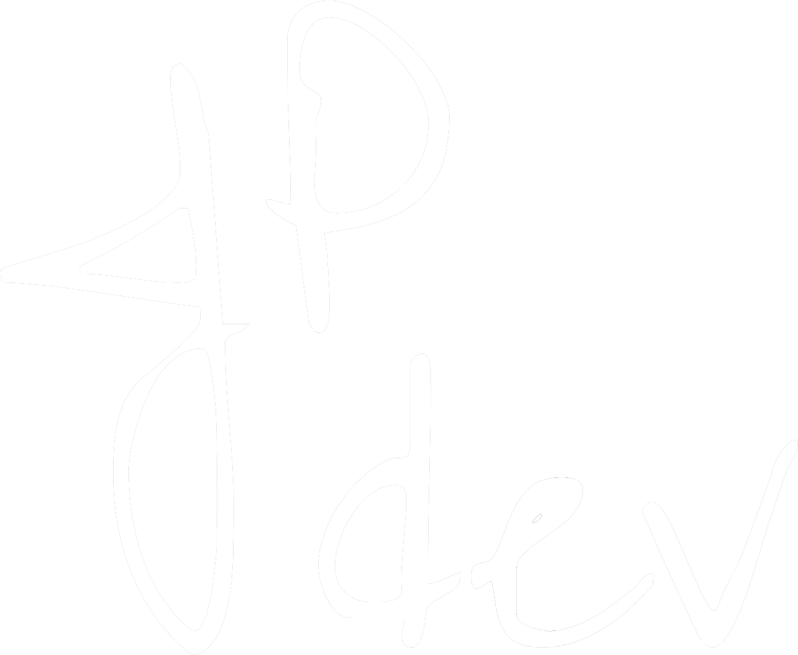

# Flutter Portfolio 

Flutter [Portfolio]() – by [@Thepilli](https://github.com/Thepilli)

## Features

- Responsive and adaptive design, inspired by [Brittany Chiang](https://brittanychiang.com)
- Implements the [Riverpod Architecture](https://codewithandrea.com/articles/flutter-app-architecture-riverpod-introduction/) by [Andrea Bizzotto](https://github.com/bizz84)
- Implements a feature-first structure
- Supports multi languages
- Supports multi themes

## License

See the [LICENSE](https://github.com/Thepilli/portfolio/blob/main/LICENSE.md) file.
